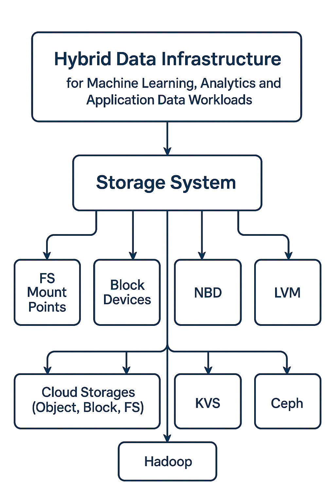
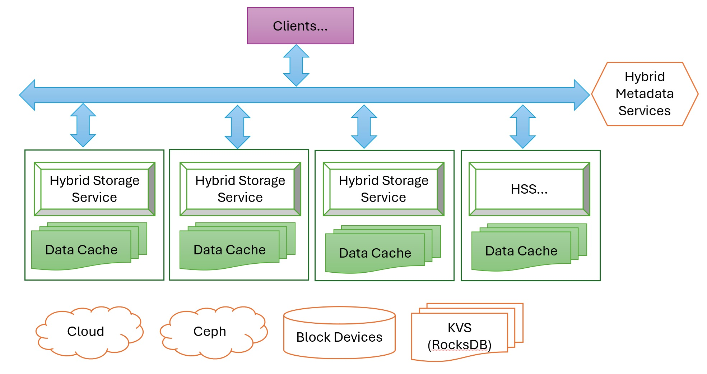

# Hybrid Storage System with Freely Combine

This storage system is to be a Hybrid data infrastructure for machine learning, analytics and application data workloads.

It can combine most common various storage provides into one:
- FS Mount Points,
- Block Devices,
- NBD,
- LVM,
- Cloud Storages (Object, Block, FS),
- KVS,
- Ceph,
- Hadoop

<table>
  <tr>
    <td></td>
    <td></td>
  </tr>
</table>

With one storage system, you can combine various storage into one as you want, e.g. [Mirror 2 local mountpointed FS](src/config/mirrortwolocalmps.json)

To AI world, one really useful case is to use a local/-cluster volume to cache target Cloud OBS. [Refer to this demo volumes toplogy](src/config/localcache4s3obs.json)

## Documentation

[For reviews on contemporary distributed and parallel storage and file systems and more details on CppIO.](https://zegang.github.io/cppio/).

## Build CPPIO
Start Container
```
$ ./devcontainer/startdevcontainer
STEP 1/5: FROM docker.io/gcc:latest
STEP 2/5: WORKDIR /workspace
--> Using cache f362f947c7d6f9224856a2d2ddea71d6d1afc84eab3750e73652a99c35e570b8
--> f362f947c7d6
STEP 3/5: COPY buildtools/cmake-3.31.4-linux-x86_64.sh /workspace
--> Using cache bb8b7c9c1deb45397d6bda077fba6475bffe6bd14c6fa5b73e55bfb167aede37
--> bb8b7c9c1deb
STEP 4/5: RUN sh /workspace/cmake-3.31.4-linux-x86_64.sh --skip-license --prefix=/usr
--> Using cache 2a65f77a841cdd66623094bf7d4f9c8f40f21a26bbc262379b99df2930134547
--> 2a65f77a841c
STEP 5/5: CMD ["bash"]
--> Using cache b4f74b806791de1c8a2881b967ff9fc52759537e7d73b545f3f572fa6128b345
COMMIT cppio
--> b4f74b806791
Successfully tagged localhost/cppio:latest
b4f74b806791de1c8a2881b967ff9fc52759537e7d73b545f3f572fa6128b345
root@1bb21add4871:/workspace#
```
Build Dependencies
```
oot@1bb21add4871:/workspace# cd cppio/
root@1bb21add4871:/workspace/cppio# ./bootstrap.sh
```
Build CPPIO
```
root@1bb21add4871:/workspace/cppio# ./makecppio.sh 
```

## Run CPPIO
Read directory "folder2" on [OBS-Local-Cached topology.](src/config/localcache4s3obs.json)

Start Service Demo
```
# ./cmake/build/src/hsd/hsd myhsd src/config/localcache4s3obs.json &
root@909d5b4ac9f9:/workspace/cppio# [2025-03-07 14:43:19.438] [info] CppIO HSD name: myhsd
[2025-03-07 14:43:19.438] [info] Starting StorageComponent storage

```
User CLI to do read on OBS if not found in local cache.
```
# ./cmake/build/src/cli/cli server fold3
[2025-03-07 14:43:24.576] [info] CppIO app name: cli
[2025-03-07 14:43:24.580] [info] VolumeCacheStriper::ReadDir(), Cache Volume MinioOBSCache, Backend Volume MinioOBS
[2025-03-07 14:43:24.580] [info] FSStorageApi::ReadDir(), volume MinioOBSCache, root path /cppiodata/minioobscache, path fold3
[2025-03-07 14:43:24.580] [info] FSStorageApi::ReadDir(), volume MinioOBSCache, root path /cppiodata/minioobscache, final path /cppiodata/minioobscache/fold3
[2025-03-07 14:43:24.590] [info] Directory does not exist.
[2025-03-07 14:43:24.590] [warning] VolumeCacheStriper::ReadDir(), volume S3OBSCacheVolume, path fold3 not found on cache volume MinioOBSCache
[2025-03-07 14:43:24.590] [info] OBSStorageApi::ListBucket(), volume MinioOBS, root path http://127.0.0.1:9000, path fold3
[2025-03-07 14:43:30.641] [info] Found 2 buckets
[2025-03-07 14:43:30.641] [info] myfirstbucket
[2025-03-07 14:43:30.641] [info] mysecondbucket
```

### Log File
```
root@1bb21add4871:/workspace/cppio/cmake/build# cat logs/cppio.log 
[2025-02-12 13:28:55.167] [file_logger] [info] CppIO app name: cppio
...
```

## Contributions
[Google C++ Style Guide](https://google.github.io/styleguide/cppguide.html)

## Contacts
zegang.luo@qq.com
